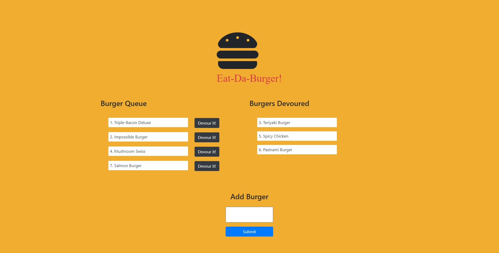

  # Eat-Da-Burger
  
  

  deployed app: [click here](https://immense-everglades-88150.herokuapp.com/)

  ### Launch page:
  

  ## Table of contents
  ​
  
  - [Description](#Descriptionn)
  - [Installation](#Installation)
  - [Usage](#Usage)
  - [Testing](#Testing)
  - [License](#License)
  - [Questions?](#Questions?)
  
  
  ## Description
  
  This application showcases full-stack web development. Given the considerable number of files, MVC code organization was practiced to ensure the code is still workable as the app scales. Of particular note is the use of ORM to minimize the amount of MySQL queries that clutter up code. This app stores burgers in a MySQL database, then utilizes express handlebars to generate the html, and relies on node.js for running the javascript code that makes up the model, view, controller, configuration, and server.
  
  ## Installation
  
  Run ``` npm i``` in the CLI, after downloading all files off of GitHub (repository is at https://github.com/anzelcapparelli/burger). If there are any missing modules after the installation command (possibly due to a missing package.json), run ```npm i express express-handlebars mysql```. Next, the MySQL database needs to be set up, so copy all code from 'db/schema.sql', and run it in MySQL. DO NOT RUN ```DROP DATABASE IF EXISTS burger_db;``` AFTER THE DATABASE SETUP STAGE!!! Will erase ALL data collected in the database. 
  
  ``` js  
  connection = mysql.createConnection({
    host: "localhost",
    port: 3306,
    user: "root",
    password: "password",
    database: "burger_db",
  });
```
  
Finally, in the 'config/connection.js' file, change the above connection object to your personal 'host', 'port', 'user', and 'password'. That's it! Now you are ready to run this app.

  ## Usage
  
  From the 'burger' directory (the root directory for the app), run ``` node server.js ``` to get the server up and running (unless you have successfully uploaded this app to a server, then disregard this step). Using the browser, go to the link for the site, then you can add new burgers to the 'Queue', or click the 'Devour it!' button to move a burger into the 'Burgers Devoured' list.
  
  ## Testing
  
  All tests are manual entry at this point (automated tests coming soon!)
  
  ## License
  
  This project is licensed under the MIT licensing.
  
  ## Questions?
  
  If you have any questions or comments, please contact me using one or more of the following:
  
  Github Profile: [https://github.com/anzelcapparelli](https://github.com/anzelcapparelli)

  Email: anzelcapparelli@gmail.com
